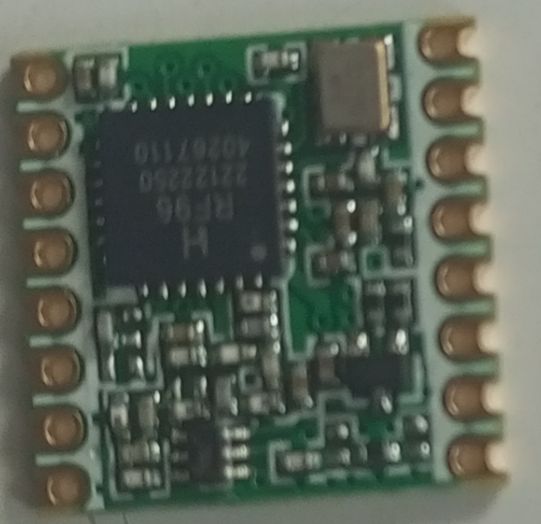
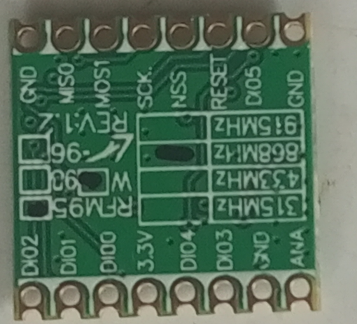
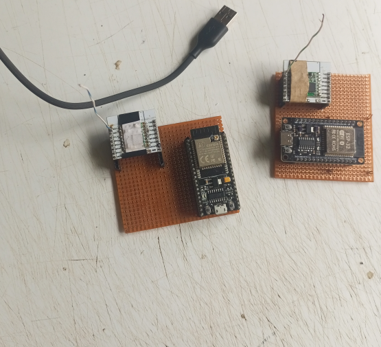
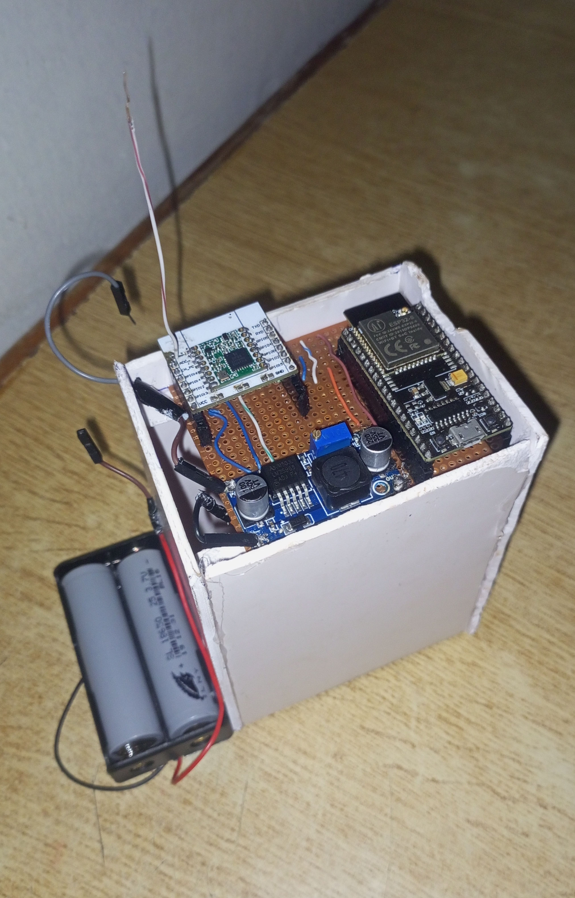
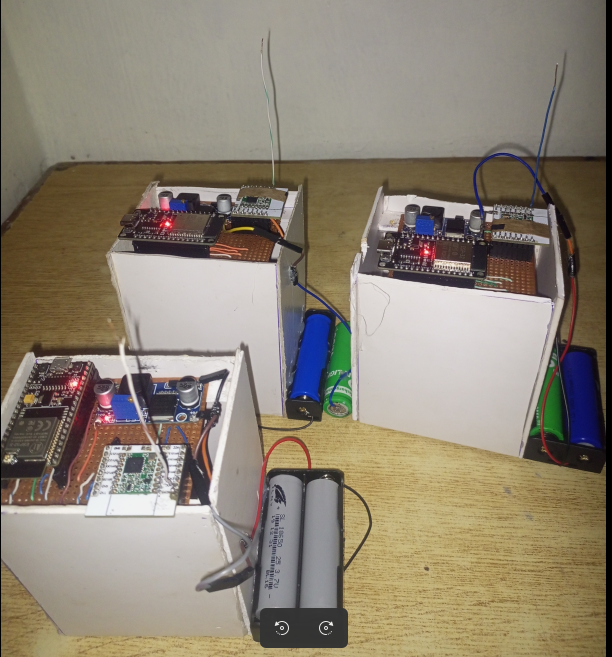

# LoRa Based mesh Network For Communiaction by Mountain climbers In Areas With Low Network Coverage

- This repo outlines the implementation process of a decentralized ad hoc LoRa Mesh network that is used to provide a communication system that supports short messages sending between end users. Users can send a direct message to each other if they are reachable with a  single hop  OR are reachable via other intermediary nodes(supports routing). A node can dynamically search for a route to destination or help another node search for a route to destination. A BLE based messaging app serves as the user interface allowing users to type in messages.

- The repo contains bare-metal firmware and a flutter-based android app. The firmware stack consits of a SX1276 driver to handle LORA, a custom ad-hoc routing protocol and a BLE GATT server for BLE support.
  
- The app sends the message to an ESP32 microcontroller via BLE which connects to a RFM95W (has a sx1276 LoRa transceiver) via SPI, the RFM95W then sends the message via LoRa modulation. Below is the realized final product

<table align="center">
  <tr>
    <td align="center" valign="top">
       
      <b>Chat screen of two nodes communicating</b>
    </td>

<td align="center" valign="top">
   
  <b>3-node system setup</b>
</td>
</tr>
</table>

- The software architecture uses a layered approach that consists of five layers namely:
  
 1. **Physical layer** - Consists of the sx1276 driver that configures the LoRa chip and provides high level functions to upper layer to interact with the radio chip. The driver is written without reliance on third party LoRa libraries and follows the [Semtech sx1276 data sheet](https://www.mouser.com/datasheet/2/761/sx1276-1278113.pdf). The code for the driver is found in src/SX1276/sx1276.cpp . The radio control layer found in src/RADIO_CONTROL/radio_control.cpp implements high level functions like sending payload, extracting payload from the lora chip and listening for incoming traffic. For more detailed dive into the working mechanics of each file. Click the links below.
     - [sx1276.cpp](google.com)
     - [radio_control.cpp](www.gooogle.com)
  
 2. **MAC layer** - Receives incoming messages from the radio layer and calls the necessary handler. It also frames message to different types before sending. For example, before  a RREQ(Route Request) message is sent, the MAC layer is the layer that appends a type to it so that other nodes that receive that RREQ can intelligently identify the message for subsequent processing. In the receiving scenario, it checks for the type of the message to know which handler to call depending on the message type that arrived. For detailed dive into the internal mechanics of the mac layer, click the link below.
 [MNAC_layer.cpp](google.com)
 1. **Network Layer** - Handles the routing mechanism. A routing protocol that is derived from AODV(Ad hoc On Demand Distance Vector) is used. On top of it a collision minimization mechanism by use of a handshake mechanism is used to lock the channel for two nodes to communicate without interference by nodes that are in range. The handshake invoves a RTS (Request to send ) request by a node that wants to send a message to another node, The destination node replies with a CTS(Clear To Send) . Nodes that can hear the CTS process it and if they are not the desired destination, they are forced to backoff for a given timeperiod that depends on the estimated time for the time on Air for the the selected SF and BW. (SF is spreading factor and it is more like a knob that controls the data rate and time on Air.)

- [rfc3561](https://archive.org/details/rfc3561)- Was used as the refence manual for AODV - AODV is not implemented in its totality but rather, its routing contol messages are used with the exception of Route Error message type which was not used.
- For more details on the routing mechanism , click the link below
- [aodv_layer.cpp]()

. **Application layer** - This is divided into the BLE GATT client and BLE GATT servers and the main file which bundles everything together. BLE bridges communication between the app and the ESP32. BLE uses a GATT architecture to facilitate comunication between two devices using bluetooth. Think of GATT model as how bluetooth communication is conducted on a high level. The GATT model involves a GATT server and a GATT client. The GATT server is implemnted by a peripheral device that a central device can connect to. Think of a peripheral device as a device that advertises itself for other devices to connect to it , but it cannot initiate the connection. The GATT client makes the connection. The GATT model relies on services and characteristics. Services are a unique way to bundle related data or functionalities together. Within each service, there can be multiple characteristics which can be thought of as the actual data. Each service and characteristic has a unique indentifier. The GATT client can write , read or subscribe(receive notifications) to the characteristics defined by the GATT server. For deeper dive into how the application layer works. Click the link below.
  
- [Application Layer](www.application)

## Hardware system

RF95W module.

<table>

<tr>

<td></td>
<td> </td>

</tr>

</table>

<table>
  <tr>
    <td></td>
    <td></td>
  </tr>
  <tr>
    <td align="center"><em>Node A</em></td>
    <td align="center"><em>Node B</em></td>
  </tr>
</table>